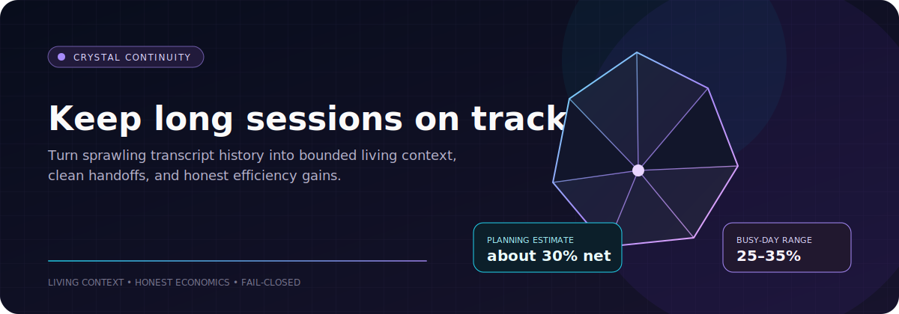

<p align="center">
  
</p>

<h1 align="center">Crystal Governance Starter</h1>

<p align="center">
  Turn long Hermes sessions into bounded living context, cleaner handoffs, and measurable efficiency gains.
</p>

<p align="center">
  <a href="https://github.com/M3NT8L-One/crystal-governance-starter/actions/workflows/validate.yml"></a>
  
  
  <a href="LICENSE"></a>
</p>

Long sessions create a strange problem: your agent has seen more, but the useful parts are harder to find inside a growing transcript. Crystal keeps a small living context beside the conversation so the current objective, constraints, decisions, open loops, and handoff state stay visible.

This repository is the public, sanitized governance kit for that pattern. It includes the checks, worker contracts, safety boundaries, and accounting needed to run Crystal without turning it into another pile of context.

## What you gain

| | Gain |
|---|---|
| 🧭 | **Better continuity.** Long sessions keep their objective, working state, decisions, and open loops close at hand. |
| 🪶 | **Less transcript drag.** After a compression boundary, compact living context can replace a much larger slice of repeated history. |
| 🔁 | **Cleaner handoffs.** Profile and session crystals separate local work from the small set of facts that should cross sessions. |
| 🛡️ | **Safer boundaries.** Background workers, subagents, cron runs, and scratch sessions stay out of the human-facing context lane. |
| 💤 | **Quiet maintenance.** Facet, Crystallizer, and Gem Cutter work on cadence and evidence instead of waking a model for every turn. |

## The gains, without the sales pitch

These figures come from one measured busy-session calibration and are useful for planning, not promises:

| Figure | What it means |
|---|---|
| **about 30%** | Net logical tokens saved as a planning estimate for two long, genuinely busy front-door sessions |
| **25–35%** | A normal busy-day range under the measured workload shape |
| **94.1%** | Reduction of the replaceable history slice across three Crystal boundaries, not total daily savings |
| **near 0%** | Expected gain for short sessions below the first boundary; maintenance can make them slightly negative |

Default Hermes compression still matters. So do the fixed system and tool prompt, calls made before the first boundary, Crystal worker maintenance, provider caching, and billing mode. Logical-token savings are not automatically billable or dollar savings.

Read [`docs/efficiency-and-savings.md`](docs/efficiency-and-savings.md) for the four accounting layers, formulas, assumptions, telemetry, and cache caveats before quoting these numbers elsewhere.

## How Crystal fits

```text
raw Hermes transcript
        ↓
deterministic tick keeps the hot state current
        ↓
Facet refines bounded sections when cadence or evidence says it is due
        ↓
Crystallizer compacts on pressure or quality debt
        ↓
Gem Cutter reviews changed, idle state and usually stays quiet
        ↓
next request gets Profile Crystal + Session Crystal + a small hot tail
```

A profile crystal carries profile-wide continuity and reviewed cross-session decisions. A session crystal holds the working context for one conversation. The sync queue is a proposal lane between them, not an automatic promotion path.

## What is included

- Profile and session scope rules, including recency-based profile-hub promotion
- Stateful 6/12/2 Facet cadence and authoritative section operations
- Crystallizer pressure and quality-hygiene contracts
- Gem Cutter spend gates, no-op paths, and hash sealing
- Front-door classification, unbound/background-review exclusion, and complete context-engine lane isolation
- Separate core-health and profile-hub-freshness verdicts
- Shared redaction, bounded writes, and concurrency guidance
- Read-only audit, health, and triage tools
- Dry-run-first registry reconciliation with archives and restoration receipts
- A read-only Hermes companion plugin scaffold
- CI, fixtures, tests, and pre-share privacy validation

Broader memory, skill, cron, and Kanban governance lives in the companion [Hermes Governance Starter](https://github.com/M3NT8L-One/hermes-governance-starter).

## Try it safely

You need Python 3.10 or newer. The starter uses only the Python standard library.

```bash
git clone https://github.com/M3NT8L-One/crystal-governance-starter.git
cd crystal-governance-starter
python3 scripts/run_crystal_checks.py \
  --root examples/sample-crystal-home \
  --out reports/demo
python3 scripts/crystal_registry_reconcile.py \
  --root examples/sample-crystal-home
python3 tests/validate_repo.py
python3 -m unittest discover -s tests -p 'test_*.py' -v
```

The sample audit writes JSON and Markdown reports to `reports/demo/`. The reconciliation command is dry-run by default. It shows what would move without changing the fixture.

Review generated reports before sharing them. Absolute roots and report paths are redacted unless you explicitly pass `--include-absolute-paths`.

## Move from sample data to real state

1. Read [`docs/setup-guide.md`](docs/setup-guide.md).
2. Read [`docs/workers.md`](docs/workers.md) for Facet, Crystallizer, and Gem Cutter.
3. Read the [efficiency guide](docs/efficiency-and-savings.md) before quoting savings.
4. Read [`docs/operations-health-and-reconcile.md`](docs/operations-health-and-reconcile.md) before registry maintenance.
5. Adapt the starter skill and policy examples.
6. Run the checks against the included sample.
7. Run them again against a copied or staged Crystal state directory.
8. Point read-only checks at live state only after you understand every path they inspect.

The expected state shape is:

```text
profiles/<profile>/PROFILE_CRYSTAL.md
profiles/<profile>/registry.json
profiles/<profile>/sessions/<session_id>/CRYSTAL.md
profiles/<profile>/sessions/<session_id>/meta.json
profiles/<profile>/sync_queue.jsonl
```

Audit, health, triage, and plugin commands are read-only except for report output. `crystal_registry_reconcile.py --apply` is different: it archives selected state and updates the registry. Review the dry-run plan first.

<details>
<summary><strong>Optional Hermes plugin smoke path</strong></summary>

```bash
python3 scripts/link_hermes_plugin.py
hermes plugins enable crystal-governance
hermes crystal-governance status
hermes crystal-governance demo --out reports/plugin-demo
```

The companion plugin exposes read-only starter checks. It does not replace a live Crystal context-engine plugin, and it does not expose reconciliation.

</details>

## Quiet by design

A healthy check should be boring:

```text
read-only audit + health check
        ├─ clean and HEALTHY → say nothing
        └─ evidence crosses a threshold → print a short wake summary
                                           ↓
                              review → fix → verify → close
```

Registry drift follows a separate path: dry-run plan first, explicit apply second, archive and receipt every time.

## Safety is part of the design

This repository does not ship credentials, raw transcripts, private memory, local paths, runtime databases, locks, personal project names, or operator-specific authority. It also grants no permission to perform external or irreversible actions.

Crystal should improve continuity without becoming an unreviewed promotion path for private context.

## Find your way around

| Path | What is there |
|---|---|
| [`docs/architecture.md`](docs/architecture.md) | The complete context and governance design |
| [`docs/workers.md`](docs/workers.md) | Facet, Crystallizer, and Gem Cutter contracts |
| [`docs/profile-session-scope.md`](docs/profile-session-scope.md) | What belongs at profile and session scope |
| [`docs/privacy-and-redaction.md`](docs/privacy-and-redaction.md) | Shared redaction and write-boundary rules |
| [`docs/efficiency-and-savings.md`](docs/efficiency-and-savings.md) | Token accounting and calibrated planning ranges |
| [`docs/operations-health-and-reconcile.md`](docs/operations-health-and-reconcile.md) | Health states and reversible registry maintenance |
| [`docs/hermes-plugin.md`](docs/hermes-plugin.md) | The read-only companion plugin |
| `examples/` | Safe sample state and transcript fixtures |

## Validate before you adapt

```bash
python3 tests/validate_repo.py
python3 -m unittest discover -s tests -p 'test_*.py' -v
```

The validator checks the current governance and efficiency contracts, runs the sample plugin path, and scans for secret-like strings, private paths, personal markers, and report leakage. The operation tests cover actor classification, health and triage behavior, dry-run safety, protected sessions, archival movement, and restoration receipts.

---

Built for people who want long [Hermes Agent](https://hermes-agent.nousresearch.com/docs) sessions to stay coherent without pretending context is free.
